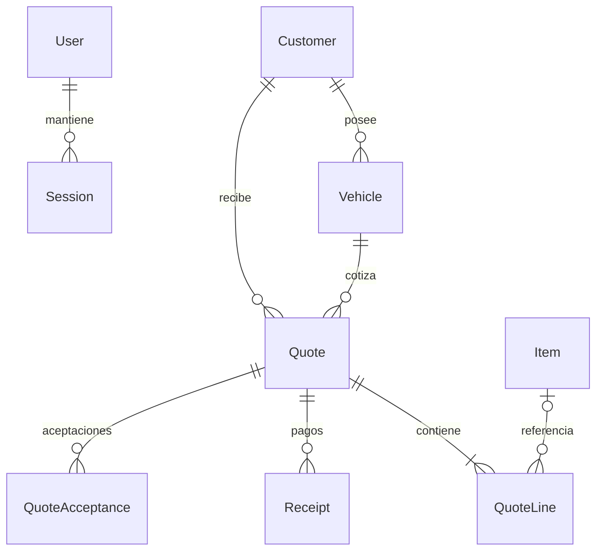

# Taller Dimensión - Cotizaciones

Sistema web para administrar clientes, vehículos, catálogo, cotizaciones, enlaces públicos, PDF profesionales y recibos de pago de un taller de desabolladura y pintura. Está construido con React + Tailwind CSS, Express 5, Prisma 6.12 y PostgreSQL.

La versión en producción usa el frontend de Vercel como entrada pública y redirige `/api` y `/uploads` hacia Render:

- Frontend: https://dimension-frontend-sage.vercel.app
- API: https://dimension-backend-479v.onrender.com/api

## Ejecutar en Windows / PowerShell

Requisitos: Node.js 22 o superior, Docker Desktop con contenedores Linux, y Python con ReportLab si se ejecuta fuera del contenedor Docker.

```powershell
npm install
Copy-Item backend/.env.example backend/.env
# Edita INITIAL_ADMIN_USERNAME e INITIAL_ADMIN_PASSWORD (mínimo 12 caracteres).
npm run db:up
npm run db:migrate
npm run db:seed
npm run dev
```

Abre http://localhost:5173 e ingresa con el usuario y contraseña iniciales de `backend/.env`. El primer inicio crea el usuario solo si no existe ningún usuario en PostgreSQL. Luego se validan siempre las credenciales guardadas en la base. Cambiar `INITIAL_ADMIN_PASSWORD` no cambia una cuenta existente; usa la opción de cambiar contraseña dentro del sistema.

Para servir el frontend compilado desde Express:

```powershell
npm run build
npm start -w backend
```

Abre http://localhost:3001. El contenedor local de PostgreSQL usa el puerto 5438 para evitar conflictos con otras bases.

## Despliegue

Render ejecuta `backend/Dockerfile`. El comando final corre `node scripts/deploy.js` y luego `node src/server.js`. Ese script aplica migraciones Prisma; si encuentra una base antigua creada con `prisma db push`, solo marca el historial como aplicado cuando el esquema existente coincide exactamente con el esquema del repositorio. Si detecta deriva, se detiene para evitar pérdida silenciosa de datos.

Variables recomendadas en Render:

```text
NODE_ENV=production
DATABASE_URL=postgresql://...
INITIAL_ADMIN_USERNAME=admin
INITIAL_ADMIN_PASSWORD=<clave fuerte de 12+ caracteres>
FRONTEND_URL=https://dimension-frontend-sage.vercel.app
TRUST_PROXY_HOPS=1
```

Vercel debe publicar el proyecto `frontend/`. El archivo `frontend/vercel.json` mantiene el proxy hacia Render y agrega cabeceras de seguridad. En producción el frontend llama a `/api`, por lo que las cookies quedan bajo el dominio de Vercel y no dependen de cookies de terceros.

## Organización

```text
backend/
  prisma/
    schema.prisma
    migrations/
    seed.js
  scripts/
    deploy.js
  src/
    app.js
    auth.js
    db.js
    money.js
    pdf.js
    quotes.js
    routes/
    security.js
    validation.js
  pdf/
    quote.py
    receipt.py
    safe_images.py
    sanitize_image.py
  test/
frontend/
  public/brand/
  src/
    App.jsx
    Login.jsx
    QuoteForm.jsx
    QuoteDocument.jsx
    Registry.jsx
    api.js
    components/
    hooks/
    theme.css
output/pdf/
```

## Modelo relacional

El esquema completo está en `backend/prisma/schema.prisma` y el SQL versionado en `backend/prisma/migrations/`.



- **Company**: datos del taller, logo, firma, contacto y términos. Sus datos se copian como snapshot en cada cotización.
- **Customer / Vehicle**: un cliente puede tener varios vehículos. La FK compuesta `(vehicleId, customerId)` impide cotizar un vehículo de otro cliente incluso mediante SQL directo.
- **Item / ItemCategory**: catálogo editable de repuestos, insumos y mano de obra. Los costos internos no se exponen en enlaces públicos ni PDF del cliente.
- **Quote / QuoteLine**: cabecera transaccional con detalles congelados al momento de cotizar. Los totales se calculan en backend con Decimal.js y se descartan totales enviados por el navegador.
- **Receipt**: pagos asociados a una cotización. Las transacciones serializables evitan sobrepagos simultáneos.
- **QuoteAcceptance**: nombre declarado, fecha, consentimiento y copia de la propuesta aceptada. La pareja `(quoteId, revision)` es única; las aceptaciones anteriores se conservan al editar.
- **User / Session**: acceso con usuario y contraseña; la sesión se guarda como hash y se entrega mediante cookie HttpOnly.

## API principal

Todas las rutas privadas requieren sesión iniciada. Las mutaciones requieren la cabecera `X-Requested-With: TallerDimension`.

| Método y ruta | Función |
| --- | --- |
| POST /api/auth/login | Acceso con usuario y contraseña |
| GET /api/auth/me | Usuario de la sesión actual |
| POST /api/auth/logout | Cerrar sesión |
| POST /api/auth/change-password | Cambiar contraseña y revocar otras sesiones |
| GET /api/health | Salud de PostgreSQL y versión |
| GET, PUT /api/company | Configuración del taller |
| POST /api/upload | Normalizar logo/firma a PNG seguro |
| GET, POST /api/customers | Listar / crear clientes |
| PUT /api/customers/:id | Editar cliente |
| GET, POST /api/vehicles | Listar / crear vehículos |
| PUT /api/vehicles/:id | Editar vehículo |
| GET, POST /api/items | Listar / crear items |
| PUT /api/items/:id | Editar item |
| GET, POST /api/categories | Listar / crear categorías |
| GET /api/quotes/metrics | Métricas del tablero |
| GET /api/quotes | Historial con búsqueda, filtro y paginación |
| POST /api/quotes | Crear cotización en transacción |
| GET, PUT, DELETE /api/quotes/:id | Leer, actualizar o eliminar cotización |
| GET /api/quotes/:id/pdf | PDF autenticado |
| PATCH /api/quotes/:id/status | Cambiar estado |
| POST, DELETE /api/quotes/:id/share | Crear o revocar enlace público |
| POST /api/quotes/:id/receipts | Registrar pago |
| GET /api/quotes/receipts/:receiptId/pdf | PDF de recibo |
| DELETE /api/quotes/receipts/:receiptId | Eliminar recibo |
| GET /api/public/quotes/:token | Vista pública limitada |
| GET /api/public/quotes/:token/pdf | PDF desde enlace público vigente |
| POST /api/public/quotes/:token/accept | Aceptar la versión vigente y marcarla como aprobada |
| GET /api/public/quotes/:token/receipts/:receiptId/pdf | Recibo perteneciente a la cotización compartida |

Los enlaces públicos funcionan como tokens portadores: quien tenga el enlace puede ver esa cotización y aceptar su versión enviada hasta que se revoque. La aceptación requiere `revision`, `acceptedBy` y `confirmed: true`, además de la cabecera de mutación. Abrir el enlace o descargar el PDF nunca aprueba la cotización.

## Aceptación por el cliente

1. Guarda la cotización y pulsa **Compartir**. El borrador pasa a **Enviada** y se habilita su enlace público.
2. Envía ese enlace al cliente. Al final de la propuesta podrá escribir su nombre, marcar el consentimiento y confirmar el total con IVA.
3. El sistema registra la aceptación y cambia el estado a **Aprobada** en una sola transacción. El panel del taller se actualiza cada 30 segundos cuando está visible, y al volver a la ventana; no interrumpe la edición.

El documento web y el listado privado identifican la aceptación del cliente. La administración puede consultar las fechas y nombres de versiones anteriores. La base de datos conserva también la propuesta completa aceptada. El nombre es declarado por quien posee el enlace; este flujo no verifica su identidad.

Editar una cotización crea una nueva versión en borrador y revoca el enlace anterior: comparte el nuevo enlace para obtener una nueva aceptación. Reabrir una cotización aprobada también revoca su enlace y conserva el historial. Las cotizaciones con aceptaciones no se pueden eliminar desde la API. Si un enlace antiguo sigue en borrador, pulsa **Compartir** para habilitarlo. El PDF descargado por sí solo no incluye un formulario de aceptación: envía el enlace web.

## PDF

El servidor genera PDF A4 reales con ReportLab. Las cotizaciones incluyen membrete, logo, datos de cliente y vehículo, tabla con items, subtotal, IVA, total destacado, observaciones, términos y numeración de páginas. Los recibos incluyen pagos, saldo y datos de la cotización.

Los logos remotos por URL HTTPS se muestran en web, pero el generador PDF no descarga imágenes externas. Para que el logo o firma aparezcan en PDF, súbelos desde la interfaz; el backend los convierte a PNG validado y los guarda como `data:image/png`.

Ejemplos con datos ficticios:

- `output/pdf/Cotizacion-Taller-Dimension-ejemplo.pdf`
- `output/pdf/Recibo-Taller-Dimension-ejemplo.pdf`

## Seguridad

La revisión completa de esta actualización está en `SECURITY_REVIEW.md`. Puntos principales:

- No hay contraseña fija `admin/admin123`; el primer usuario exige una contraseña inicial fuerte.
- Las contraseñas usan scrypt con sal aleatoria.
- Las sesiones se guardan como SHA-256 del token y se envían en cookie HttpOnly, Secure en producción y SameSite=Lax.
- CORS permite orígenes exactos y rechaza cualquier `Origin` no autorizado.
- Vercel aplica CSP, `frame-ancestors 'none'`, `X-Frame-Options`, `nosniff`, `Referrer-Policy` y `Permissions-Policy`.
- Las descargas PDF, login, cambio de contraseña, uploads y aceptación pública tienen límites de frecuencia en memoria.
- Las imágenes para PDF no pueden ser URLs arbitrarias ni rutas locales; se validan tipo, peso y dimensiones.

Limitaciones actuales: el limitador vive en memoria del proceso, no hay roles por usuario, no hay recuperación de contraseña, no hay auditoría histórica de cada mutación y los enlaces públicos siguen siendo válidos para cualquiera que posea el token hasta revocación.

## Verificación

Comandos usados para validar la actualización:

```powershell
npm run build
npm test
node --env-file=backend/tmp/qa.env backend/scripts/deploy.js
node --env-file=backend/tmp/qa.env --test backend/test/integration.js backend/test/acceptance.integration.js
python -m unittest discover -s backend/test -p "test_*.py"
```

También se revisó visualmente el login, el tablero, la búsqueda/paginación, el formulario con totales automáticos, el aviso de cambios sin guardar, el menú móvil y los PDF renderizados a imagen.

La actualización de aceptación (2026-09-21) se verificó con 9 pruebas unitarias, 11 pruebas de integración (incluidas concurrencia, revocación, versiones antiguas y recibos públicos) contra PostgreSQL aislado, 3 pruebas Python, migración sobre base limpia y compilación del frontend. En navegador se comprobó el formulario de aceptación en escritorio y móvil, la cancelación, la confirmación y la persistencia del estado tras recargar, usando únicamente datos ficticios locales.

## Ampliaciones recomendadas

Para crecer el sistema, los siguientes módulos pueden integrarse sin romper los precios históricos ya congelados en cotizaciones:

- Roles y permisos por usuario.
- Inventario de repuestos e insumos.
- Fotografías de daños por cotización.
- Flujo de reparación por estado de taller.
- Envío de cotizaciones por correo o WhatsApp.
- Auditoría de cambios y respaldo programado de PostgreSQL.
