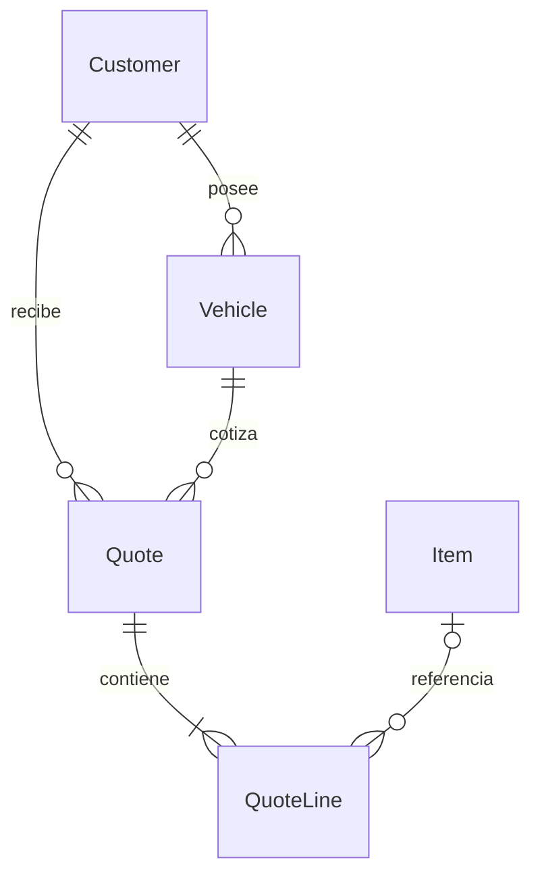

# Taller Dimensión - Cotizaciones

Base funcional en español: React + Tailwind CSS, Express 5, Prisma 6.12 y PostgreSQL 17. Importes en CLP, precios netos y porcentaje de impuesto configurable (valor inicial 19%).

## Ejecutar en Windows / PowerShell

Requisitos: Node.js 22 o superior, Python 3.10+ con ReportLab y Docker Desktop iniciado con contenedores Linux (o PostgreSQL propio).

```powershell
npm install
Copy-Item backend/.env.example backend/.env
# Edita INITIAL_ADMIN_USERNAME e INITIAL_ADMIN_PASSWORD (mínimo 12 caracteres).
python -m pip install -r backend/pdf/requirements.txt
# PYTHON_BIN puede apuntar a un ejecutable Python con ReportLab instalado.
npm run db:up
npm run db:migrate
npm run db:seed
npm run dev
```

Abre http://localhost:5173 e ingresa con el usuario y contraseña iniciales de backend/.env. El primer inicio crea el usuario solamente si todavía no existe ningún usuario; después se validan las credenciales guardadas en PostgreSQL. Cambiar las variables iniciales no cambia una cuenta ya creada. Los datos de ejemplo son ficticios. Si tienes PostgreSQL propio, cambia DATABASE_URL y omite db:up. El contenedor usa el puerto local 5438 para evitar interferir con otras bases. `db:seed` es idempotente y no sobrescribe los registros existentes.

Para servir la compilación desde Express:

```powershell
npm run build
npm start -w backend
```

Abre http://localhost:3001. Los dos servidores escuchan solo en la interfaz local. Para compartir enlaces con clientes externos, despliega frontend y API bajo el mismo dominio HTTPS mediante un proxy inverso; el enlace se genera con el origen actual. Un enlace localhost no es accesible desde el equipo de un cliente.

## Organización

```text
backend/
  prisma/
    schema.prisma           # Entidades, enums, llaves e índices
    migrations/             # SQL versionado para PostgreSQL
    seed.js                 # Taller, cliente, vehículo e ítems ficticios
  src/
    app.js                  # Rutas, autorización, controladores y errores
    server.js               # Inicio HTTP y distribución del frontend compilado
    db.js                   # Cliente Prisma
    quotes.js               # Servicio transaccional y proyección pública
    validation.js           # Esquemas Zod de entrada
    money.js                # Cálculos decimales autoritativos
    auth.js                 # Hash scrypt, usuarios y sesiones con cookie HttpOnly
    pdf.js                  # Generación de PDF por proceso Python
  pdf/quote.py              # Diseño A4 profesional con ReportLab
  test/
    money.test.js           # Cálculos, validación y privacidad
    integration.js          # Transacciones y API contra PostgreSQL real
frontend/
  src/
    App.jsx                 # Acceso, navegación, historial y enlaces
    QuoteForm.jsx           # Formulario dinámico y cálculo automático
    QuoteDocument.jsx       # Documento del cliente e impresión
    Registry.jsx            # Alta y edición de maestros
    api.js                  # Cliente HTTP autenticado
    styles.css              # Diseño responsive y estilos A4
docker-compose.yml
```

## Modelo relacional

El esquema completo está en `backend/prisma/schema.prisma` y su SQL inicial en `backend/prisma/migrations/`.



- **Company**: configuración de un único taller (registro id=1). Nombre, URL del logo, RUT, dirección, teléfono, correo y términos. Sus datos se copian en cada cotización mediante JSON; editar el taller no altera documentos históricos.
- **Customer → Vehicle**: uno a muchos, con FK obligatoria e índice por cliente. RUT y patente únicos; VIN opcional único. Se guarda el identificador fiscal como texto, sin imponer un algoritmo de RUT para permitir otros identificadores.
- **Quote → Customer / Vehicle**: FK al cliente y FK compuesta `(vehicleId, customerId)` que exige pertenencia del vehículo al cliente incluso en escrituras SQL directas.
- **Quote ↔ Item**: muchos a muchos mediante **QuoteLine**, que también admite ítems libres (`itemId=null`). Cada detalle conserva nombre, descripción, categoría, cantidad, precio unitario y total. No se expone el costo interno en documentos públicos.
- **Quote**: número secuencial único, fecha de creación del servidor, estado, observaciones, términos, snapshots, tasa, subtotal, impuesto y total. La numeración PostgreSQL puede tener saltos por rollback; no equivale a un folio tributario.
- **QuoteLine**: posición única dentro de la cotización. Eliminar una cotización elimina sus detalles; eliminar un ítem conserva sus detalles históricos sin referencia. Cliente y vehículo se protegen con `Restrict`.

## Creación transaccional

`POST /api/quotes` valida los datos con Zod y ejecuta `createQuote()` dentro de `prisma.$transaction`, con aislamiento Serializable. Consulta cliente, vehículo, empresa y catálogo, valida las relaciones y crea cabecera y detalles mediante escritura anidada. Cualquier error revierte la operación completa. Los conflictos simultáneos devuelven 409 para reintentar.

```json
{
  "customerId": "UUID-CLIENTE",
  "vehicleId": "UUID-VEHICULO",
  "taxRate": 19,
  "observations": "Reparación de parachoques. Entrega estimada: 3 días hábiles.",
  "lines": [
    { "itemId": "UUID-ITEM", "quantity": 1 },
    { "name": "Pulido adicional", "category": "MANO_OBRA", "quantity": 1, "unitPrice": 25000 }
  ]
}
```

Para ítems del catálogo, omitir `unitPrice` usa el precio registrado. Un administrador puede ajustar `unitPrice` explícitamente. Los totales recibidos del navegador se descartan. Decimal.js evita errores binarios: cada línea se redondea a pesos (mitades hacia arriba); se suman las líneas redondeadas; el IVA se redondea una vez y se suma al subtotal. El frontend usa la misma regla. Máximo 100 líneas por cotización.

## API

Todas las rutas administrativas requieren una sesión iniciada mediante `POST /api/auth/login` con `{username,password}`. Las mutaciones requieren `X-Requested-With: TallerDimension`. La cookie de sesión es HttpOnly, SameSite=Strict y dura 8 horas. En producción (`NODE_ENV=production`) se envía solo por HTTPS. No se aceptan claves Bearer. Las contraseñas se almacenan con scrypt y sal aleatoria; la base guarda únicamente el hash del token de sesión. El límite de intentos es de 10 por IP cada 15 minutos, en memoria del proceso.

| Método y ruta | Función |
| --- | --- |
| POST /api/auth/login | Acceso con usuario y contraseña |
| GET /api/auth/me | Usuario de la sesión actual |
| POST /api/auth/logout | Invalidar sesión y borrar cookie |
| GET /api/health | Conectividad de PostgreSQL |
| GET, PUT /api/company | Leer / configurar el taller |
| GET, POST /api/customers | Listar / crear clientes |
| PUT /api/customers/:id | Editar cliente |
| GET, POST /api/vehicles | Listar / crear vehículos |
| PUT /api/vehicles/:id | Editar vehículo |
| GET, POST /api/items | Listar / crear ítems |
| PUT /api/items/:id | Editar ítem |
| GET, POST /api/quotes | Últimas 100 / crear cotización |
| GET /api/quotes/:id | Documento con detalles |
| GET /api/quotes/:id/pdf | Descarga PDF autenticada |
| GET /api/public/quotes/:token/pdf | Descarga PDF del enlace público vigente |
| PATCH /api/quotes/:id/status | Actualizar BORRADOR / ENVIADA / APROBADA |
| POST /api/quotes/:id/share | Generar enlace aleatorio; invalida el anterior |
| DELETE /api/quotes/:id/share | Revocar enlace |
| GET /api/public/quotes/:token | Vista pública limitada, sin clave administrativa |

Los estados se administran manualmente; marcar ENVIADA no envía mensajes y APROBADA registra la decisión informada al taller. Compartir genera un enlace de solo lectura con token aleatorio de 256 bits; quien lo tenga puede ver esa cotización hasta su revocación. Las tablas User y Session soportan cuentas individuales. Esta entrega crea un administrador inicial; no incluye pantalla de gestión de usuarios, roles ni recuperación de contraseña.

## PDF

Abre una cotización guardada y pulsa **Descargar PDF**. El servidor entrega un PDF A4 real generado con ReportLab, sin depender del diálogo del navegador. Incluye membrete, logo, número, fecha, datos del cliente y vehículo, tabla de trabajos, subtotal, IVA, total destacado, condiciones y numeración de páginas. La tabla repite sus encabezados y las notas extensas admiten saltos de página.

El logo original se encuentra en `frontend/public/brand/taller-dimension.png`. La empresa usa esa ruta relativa para incluirlo tanto en web como en PDF. Los logos remotos configurados por URL se muestran en web; el generador PDF no descarga recursos remotos y en ese caso presenta el nombre del taller. Los documentos guardados mantienen su identidad histórica.

Ejemplo con datos ficticios: `output/pdf/Cotizacion-Taller-Dimension-ejemplo.pdf`. Para regenerarlo:

```powershell
node --env-file=backend/.env backend/scripts/example-pdf.js
```

## Verificación

```powershell
npm test
npm run build
npm exec -w backend prisma validate
# Con base migrada y datos de ejemplo:
npm run test:integration -w backend
```

La prueba de integración crea únicamente registros con identificadores aleatorios, comprueba rollback tras una cabecera y detalle válidos seguidos por un detalle con FK inválida, pertenencia del vehículo en PostgreSQL, importes, snapshot del precio, autenticación y revocación pública; limpia sus registros al terminar.

## Límites y ampliaciones

Esta entrega es una base local para un solo taller. Para un despliegue con varios operadores, agregar gestión de usuarios, roles, recuperación de contraseña, auditoría y copias de seguridad. El limitador en memoria debe sustituirse por uno compartido si se ejecutan varias instancias. El historial muestra los últimos 100 registros, sin búsqueda ni paginación. Las cotizaciones guardadas conservan su contenido; se puede cambiar estado, generar/revocar enlace y crear otra propuesta, pero no editar sus líneas desde la interfaz. No incluye inventario, adjuntos fotográficos, firma electrónica, envío de correo ni integración tributaria. Los nuevos módulos pueden referenciar Vehicle, Quote e Item sin alterar los precios históricos.

Referencias de implementación: [transacciones Prisma 6](https://www.prisma.io/docs/orm/v6/prisma-client/queries/transactions) y [Tailwind con Vite](https://tailwindcss.com/docs/installation/using-vite).

## Validación de esta actualización

Pasaron 7 pruebas unitarias, la integración PostgreSQL (login, cookie, CSRF, rechazo de Bearer, PDF autenticado, logout y revocación), y la compilación Vite. Se renderizó y revisó el PDF de ejemplo de una página, además de páginas representativas de una cotización de estrés con 100 líneas y notas extensas. Referencias: [scrypt de Node.js](https://nodejs.org/download/release/v22.12.0/docs/api/crypto.html) y [tablas ReportLab](https://docs.reportlab.com/reportlab/userguide/ch7_tables/).
